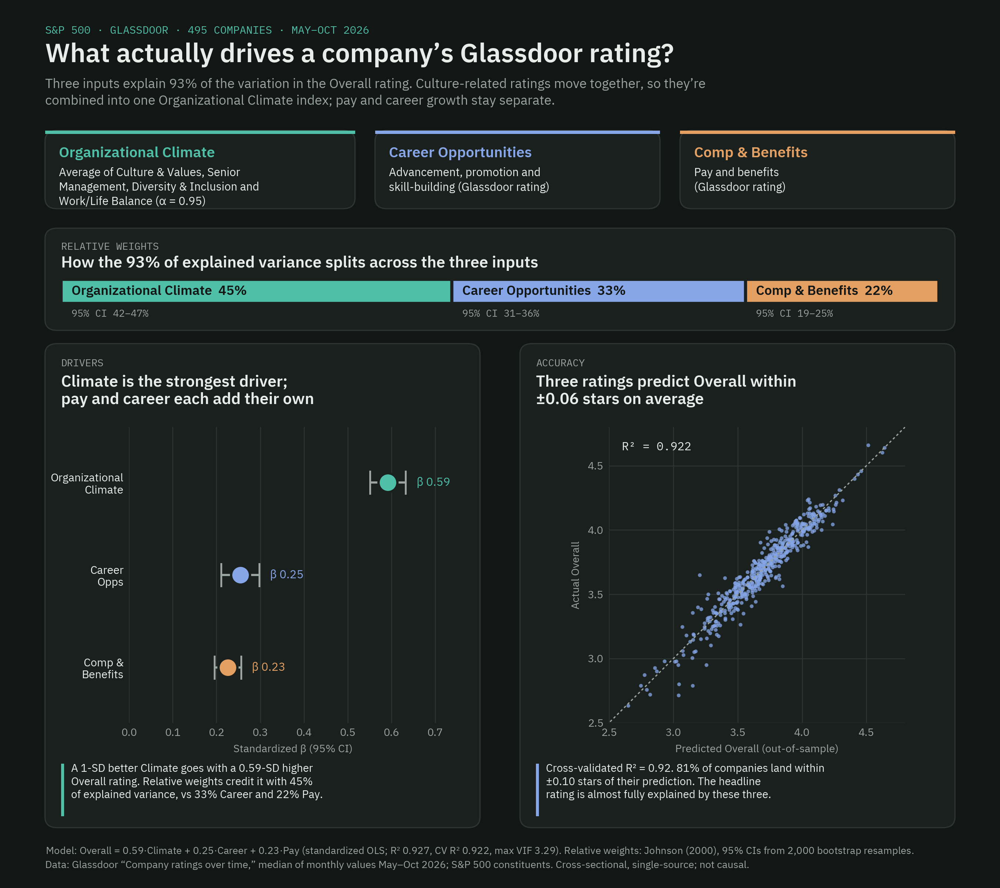
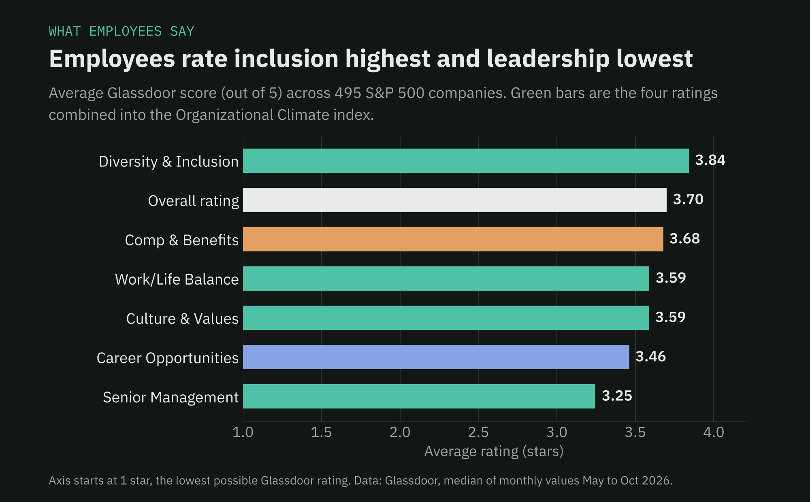
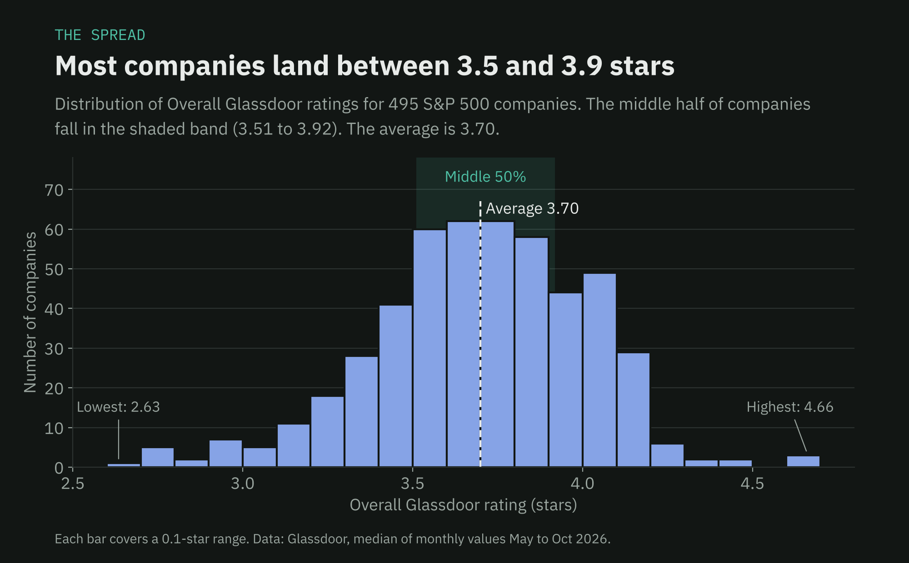
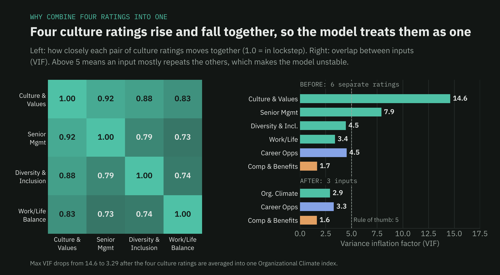
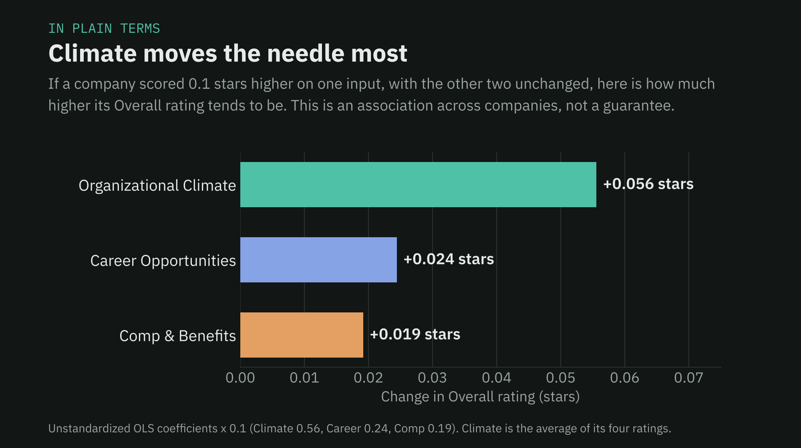

# Glassdoor Employee Sentiment Machine Learning Model

**Question:** Which Glassdoor subratings are associated with the greatest percentage of variance in a company's overall Glassdoor rating?

**Result:** 3 variables explain ~92.2% of the variance in overall Glassdoor ratings (5-fold CV x 10 repeats; R² = 0.922).



### Relative Weights of Each Variable

1. **Organizational Climate (45%)**
   - Composite of Senior Management, Culture & Values, Diversity & Inclusion, and Work/Life Balance (alpha = 0.94)
2. **Career Opportunities (33%)**
3. **Compensation and Benefits (22%)**

---

## The Model in Four Charts

### 1. What employees say

Across the S&P 500, Diversity & Inclusion is the highest rated subrating and Senior Management is the lowest.



### 2. The spread

Overall ratings cluster tightly. Half of all companies sit between 3.51 and 3.92 stars, so small differences in the inputs matter.



### 3. Why four ratings became one

Culture & Values, Senior Management, Diversity & Inclusion and Work/Life Balance move almost in lockstep. Kept separate, they overlap so much that the model can't tell them apart (max VIF 14.6). Averaged into one Organizational Climate index, the overlap disappears (max VIF 3.29).



### 4. In plain terms

Holding the other two inputs steady, a company that scores 0.1 stars higher on Organizational Climate tends to have an Overall rating about 0.056 stars higher. That is more than double the association for Career Opportunities or Compensation & Benefits.



---

## Data

1. 495 Glassdoor profiles from companies in the S&P 500 (as of 9/30/26)
2. Median values collected from May to October 2026 for each of the seven original variables
   - Senior Management, Culture & Values, Diversity & Inclusion, Work/Life Balance, Career Opportunities, Compensation & Benefits, and Overall Rating
3. Organizational Climate was made into a composite variable to prevent collinearity

## EDA Highlights

- Overall Rating mean is 3.70
- Interquartile Range from 3.51 to 3.92
- Diversity & Inclusion had the highest mean rating overall among feature variables
- Senior Management had the lowest mean rating overall among feature variables

## Preparation

- Original linear model had all 6 feature variables against the Overall Rating target (Max VIF of 14.6)
  - Combining the Senior Management, Culture & Values, Diversity & Inclusion and Work/Life Balance variables into one composite variable reduced collinearity (All VIFs < 5)

## Model

- Multiple linear regression OLS with standardized coefficients
  - Validated by elastic net (α = 0.0085, l1_ratio = 0.05, mostly ridge)
- 80/20 train/test split
- Johnson's Relative Weights Analysis to determine individual contribution among variables in the model

## Evaluation

- Train R² 0.932, test R² 0.899
- 5-fold x 10 repeats CV R² 0.922 (range 0.853 to 0.967), average miss 0.06 stars

## Takeaway

Organizational climate had the strongest association with a company's overall Glassdoor rating, accounting for 45% of explained variance. It's worth considering these climate factors when diagnosing talent management issues in an organization. It's also worth noting that career opportunities and compensation/benefits also hold significant correlational weight, just not to the extent of all the similar variables listed as a collective.

## Limitations

Correlation does not equate to causation. Glassdoor ratings are also prone to self-selection bias. To branch off that, the same reviewers rate every single dimension, which could make the data susceptible to a Halo Effect. Lastly, the data only consists of S&P 500 companies. Testing the generalizability of the model to other corporations would be the next best practice.

---

## Repo Structure

```
glassdoor-rating-model/
├── src/
│   ├── model.py        # composite, VIF, standardized OLS, relative weights, train/test, elastic net, repeated CV
│   └── charts.py       # builds images/02 to 05
├── results/            # every table the script produces (CSV)
│   ├── model_summary.csv
│   ├── coefficients.csv
│   ├── relative_weights.csv
│   ├── vif.csv
│   ├── correlations.csv
│   ├── descriptives.csv
│   └── cv_folds.csv
├── images/             # charts used in this README
├── data/README.md      # expected data schema
└── requirements.txt
```

## Reproduce

```bash
pip install -r requirements.txt
python src/model.py --data data/glassdoor_sp500_medians.csv
python src/charts.py --data data/glassdoor_sp500_medians.csv
```

`model.py` writes all tables to `results/` and prints the key numbers. Rerunning it on the median values (stored to 3 decimals) reproduces the headline figures within rounding: standardized betas 0.59 / 0.25 / 0.22, relative weights 45% / 33% / 22%, max VIF 14.6 before and 3.29 after, test R² 0.90, and CV R² 0.925 with `random_state=42`. Small differences from the figures above (for example CV R² 0.922) come from the random fold assignment.

## About the Data

Ratings come from Glassdoor's public "Company ratings over time" charts. Company-level data is not redistributed in this repo; the charts and tables are derived from it. See `data/README.md` for the expected format.
